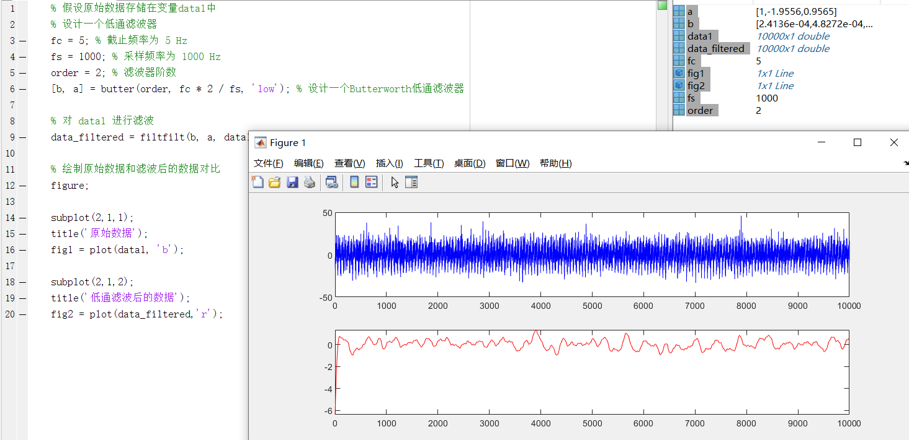
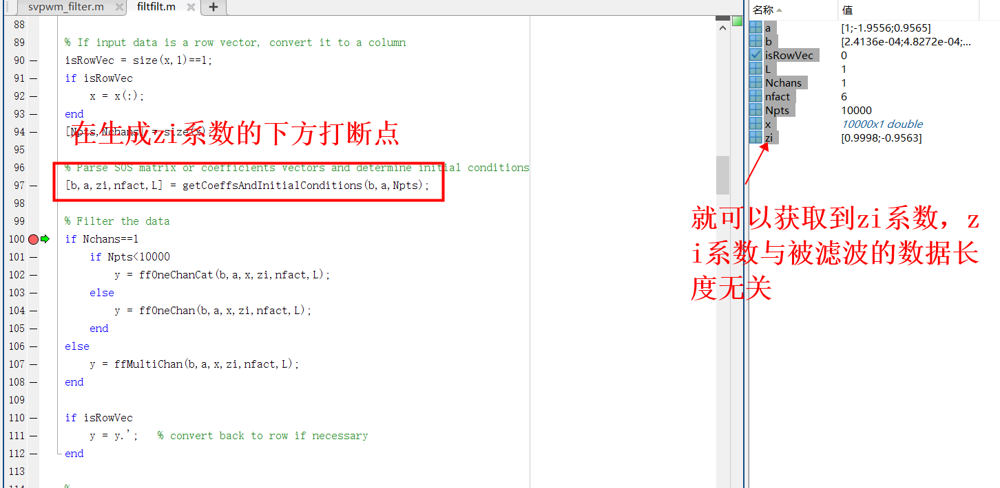
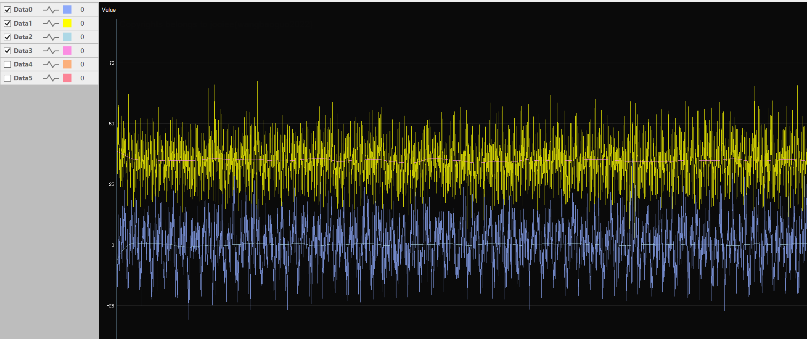
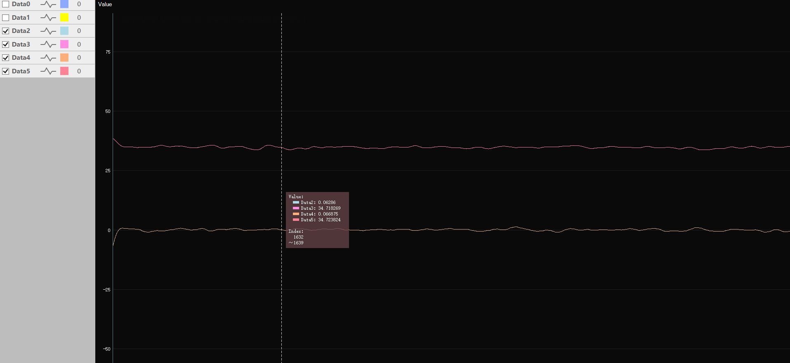

# Filter模块（by：睿智的嵌入式（WiseMCU））
模仿Matlab的Filter（一维的数字滤波器）和Filtfilt（零相位滤波）写的C语言版

Filter（一维的数字滤波器）输出结果与Matlab的结果完全一致

Filtfilt（零相位滤波）输出结果与Matlab的结果基本一致，如果a、b、zi、输入参数长度都保持一致，结果也与Matlab结果一致

### Demo使用方法

1.  #### 获取到滤波器系数

    以Butterworth二阶低通滤波器为例

    ```matlab
    % 假设原始数据存储在变量data1中
    % 设计一个低通滤波器
    fc = 5; % 截止频率为 5 Hz
    fs = 1000; % 采样频率为 1000 Hz
    order = 2; % 滤波器阶数
    [b, a] = butter(order, fc * 2 / fs, 'low'); % 设计一个Butterworth低通滤波器
    
    % 对 data1 进行滤波
    data_filtered = filtfilt(b, a, data1);
    
    % 绘制原始数据和滤波后的数据对比
    figure;
    
    subplot(2,1,1);
    title('原始数据');
    fig1 = plot(data1, 'b');
    
    subplot(2,1,2);
    title('低通滤波后的数据');
    fig2 = plot(data_filtered,'r');
    ```

    在工作区填入data1数据然后运行得到结果

    

    可视化滤波结果，再调节滤波器参数得到理想滤波结果，保存a、b系数和滤波器阶数，由于无法直接获取到zi系数所以需要在filtfilt里面打断电获取到zi系数，如果是用filter滤波器则不需要zi系数

    

2.  #### 编写测试demo程序

    准备好data.csv原始数据，并编写C语言读取原始数据计算滤波

    ```c
    /* 读取data.csv文件数据，数据结构为%f %f */
    void readData(const char *filename, float *data1, float *data2, int len)
    {
        FILE *fp = fopen(filename, "r");
        if (fp == NULL)
        {
            printf("Failed to open file %s\n", filename);
            return;
        }
    
        for (int i = 0; i < len; i++)
        {
            fscanf(fp, "%f,%f", &data1[i], &data2[i]);
        }
    
        fclose(fp);
    }
    
    int main(void)
    {
        /* 读取数据 */ 
        const int len = 10000;
        float input_data1[len], input_data2[len], matlab_output1[len], matlab_output2[len];
        
        readData("data.csv", input_data1, input_data2, len);
        readData("matlab.csv", matlab_output1, matlab_output2, len);
    
        /* 创建滤波器对象 */ 
        Filter filter = {
            .order  = 2,
            .a      = {1.0f,-1.955578240315035f,  0.956543676511203f},
            .b      = {0.000241359049041f, 0.000482718098083f, 0.000241359049041f},
            .zi     = {0.999758640950951f, -0.956302317462154f},
        };
    
        /* 计算滤波 */
        float sout1[len], sout2[len];
    
        filtfilt_calc(&filter, input_data1, sout1, len);
        filtfilt_calc(&filter, input_data2, sout2, len);
    
        /* 保存数据到output.csv */
        FILE *fp = fopen("output.csv", "w");
        if (fp == NULL)
        {
            printf("Failed to open file output.csv\n");
            return 0;
        }
    
        /* 将所有数据写入 */
        for (int i = 0; i < len; i++)
        {
            fprintf(fp, "%f,%f,%f,%f,%f,%f\n", input_data1[i], input_data2[i], 
                matlab_output1[i], matlab_output2[i], sout1[i], sout2[i]);
        }
    
        return 0;
    }
    ```

    demo里面同时把matlab的计算结果也保存并输出到output.csv里面

3.  运行demo，可视化结果

    [^原始数据-Matlab计算结果]: 滤波效果达到预期

    

    [^原始数据-C语言计算结果]: 实际滤波效果达到预期

    

    [^Matlab计算结果-C语言计算结果]: 结果完全一致

    

