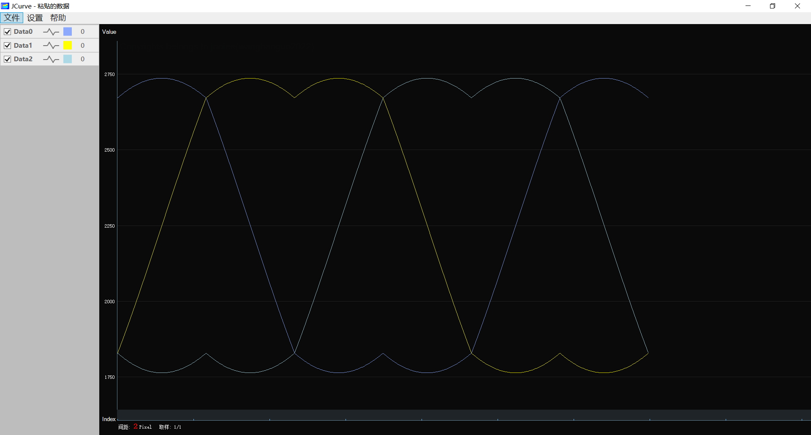

# SVPWM模块（by：睿智的嵌入式（WiseMCU））
使用SVPWM输出马鞍波，原仓库：[rubinsteina13/C_SVPWM_LIB](https://github.com/rubinsteina13/C_SVPWM_LIB)

可以直接使用，不需要额外配置

使用示例：

```c
/* 宏定义PI */
#define PI    3.1415926535897f
svpwm_t svpwm = SVPWM_DEFAULTS;
/* 配置电矢量模式 */
svpwm.para_type = US_ANGLE;
/* 配置母线电压10V */
svpwm.u_dc = 10.0f;
/* 配置定时器计数值1000 */
svpwm.counter_period = 1000;
/* 配置电矢量模1V */
svpwm.vector_value = 1.0f;
/* 配置电矢量角度60° */
svpwm.vector_angle = PI / 3;
/* 开始计算三相输出的比较器值 */
svpwm.m_calc(&svpwm);
/* 打印结果 */
DEBUG("Angle: %f, A: %f, B: %f, C: %f", svpwm.vector_angle, 
    svpwm.a_pwm_duty, svpwm.b_pwm_duty, svpwm.b_pwm_duty);
```

按以上配置编写测试DEMO：

```c
for(float angle = 0.0f; angle < 2 * PI; angle += 0.01f)
{
    svpwm.vector_angle = angle; // 更新角度
    svpwm.m_calc(&svpwm);
    DEBUG("Angle: %f, A: %f, B: %f, C: %f", svpwm.vector_angle, 
        svpwm.a_pwm_duty, svpwm.b_pwm_duty, svpwm.b_pwm_duty);
}
```

将数据可视化，结果如图：

