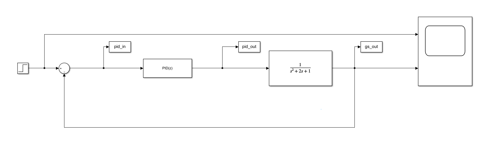
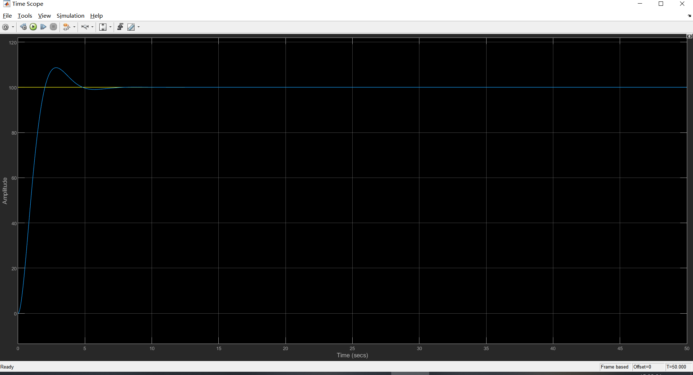
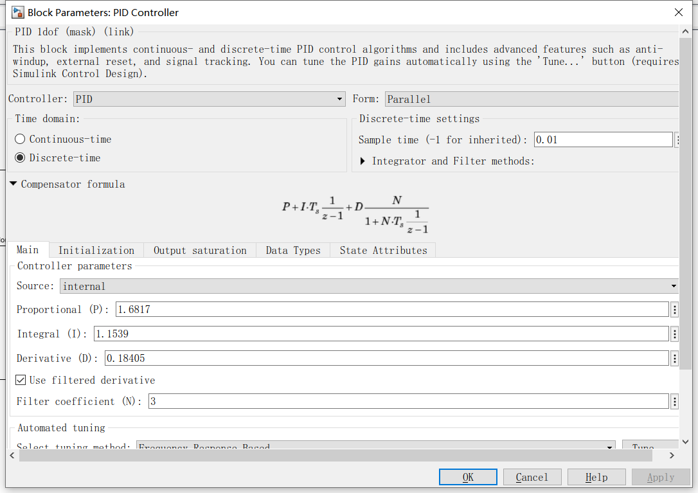

# PID模块（by：睿智的嵌入式（WiseMCU））
PID控制模块无须额外配置直接使用

### DEMO使用说明

1.  #### 获取PID控制器参数

    打开Matlab的Simulink创建一个PID系统仿真
    
    训练PID参数达到合适滤波效果
    
    假设如图已经达到预期效果获取PID参数，同时**将Simulink的PID输入输出导出到Matlab.csv**
    

2.  #### 编写测试demo程序

    1.  准备好matlab.csv数据，编写C语言使用Matlab的PID系数创建PID，并按照Matlab的PID输入计算一遍比较输出结果

        ```c
        #include <stdio.h>
        #include "pid.h"
        
        /* 读取csv文件数据，数据结构为%f %f */
        void readData(const char *filename, float *data1, float *data2, int len)
        {
            FILE *fp = fopen(filename, "r");
            if (fp == NULL)
            {
                printf("Failed to open file %s\n", filename);
                return;
            }
        
            for (int i = 0; i < len; i++)
            {
                fscanf(fp, "%f,%f", &data1[i], &data2[i]);
            }
        
            fclose(fp);
        }
        
        #define Kp      1.6817
        #define Ki      1.1539
        #define Kd      0.18405
        
        int main()
        {
            /* 读取数据 */ 
            const int len = 5000;
            float matlab_pid_in[len], matlab_pid_out[len], pid_out[len];
            readData("matlab.csv", matlab_pid_in, matlab_pid_out, len);
        
            pid_t pid_handle;
            pid_init(&pid_handle, Kp, Ki, Kd, 0, 0xFFFF);
            
            for(int i = 0; i < len; i++)
            {
                pid_out[i] = pid_calc(&pid_handle, matlab_pid_out[i]);
            }
        
            /* 保存数据到output.csv */
            FILE *fp = fopen("output.csv", "w");
            if (fp == NULL)
            {
                printf("Failed to open file output.csv\n");
                return 0;
            }
        
            /* 将所有数据写入 */
            for (int i = 0; i < len; i++)
            {
                fprintf(fp, "%f,%f\n", pid_out[i], matlab_pid_in[i]);
            }
        
            fclose(fp);
        
            return 0;
        }int main()
        {
            /* 读取数据 */ 
            const int len = 5000;
            float matlab_pid_in[len], matlab_pid_out[len], pid_out[len];
            readData("matlab.csv", matlab_pid_in, matlab_pid_out, len);
        
            /* 按照Matlab的PID系数创建PID并计算PID */
            pid_t pid_handle;
            pid_init(&pid_handle, Kp, Ki, Kd, 0, 0xFFFF);
            for(int i = 0; i < len; i++)
            {
                pid_out[i] = pid_calc(&pid_handle, matlab_pid_out[i]);
            }
        
            /* 保存数据到output.csv */
            FILE *fp = fopen("output.csv", "w");
            if (fp == NULL)
            {
                printf("Failed to open file output.csv\n");
                return 0;
            }
        
            /* 将所有数据写入 */
            for (int i = 0; i < len; i++)
            {
                fprintf(fp, "%f,%f\n", pid_out[i], matlab_pid_in[i]);
            }
        
            fclose(fp);
        
            return 0;
        }
        ```

3.  #### 运行demo，可视化结果

    [^Matlab的PID计算结果-C语言PID计算结果 ]: 结果不完全一致，在开始的一段时间不一致，逐渐趋于一致

    